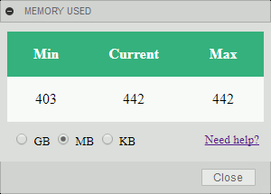

#  Fusion 360 - Memory Used
An add-in that displays the memory consumption of Fusion 360.

## Installation

Download and install the free GitHub2Fusion360 add-in ([Windows](https://apps.autodesk.com/FUSION/fr/Detail/Index?id=789800822168335025&appLang=en&os=Win64) or [Mac](https://apps.autodesk.com/FUSION/fr/Detail/Index?id=789800822168335025&os=Mac&appLang=en)) available on the Autodesk App Store.

Run the GitHub2Fusion360 add-in in Fusion 360 and copy/paste the URL of the repo: [https://github.com/JeromeBriot/fusion360-memory-used/](https://github.com/JeromeBriot/fusion360-memory-used/)

## Usage

Run the MemoryUsed add-in and you should see a new button with a green icon () on the quick access toolbar on the upper right corner of the Fusion 360 UI. Click on the button to toggle the visibility of the memory panel.

The amount of memory used by Fusion 360 is updated every second.

## Memory metric

The add-in is based on the [psutil](https://pypi.org/project/psutil/) library (process and system utilities). It monitors the USS (Unique Set Size) memory which is unique to a process and which would be freed if the process was terminated right now. See this [blog post](http://grodola.blogspot.com/2016/02/psutil-4-real-process-memory-and-environ.html).

## Limitations

The monitoring is paused if the data panel is opened in Fusion 360. This is due to a bug that has been reported: [custom event + palette.sendInfoToHTML + data panel = Fusion 360 frozen](https://forums.autodesk.com/t5/fusion-360-api-and-scripts/custom-event-palette-sendinfotohtml-data-panel-fusion-360-frozen/m-p/7957599).

## License
Codes are licensed under the terms of the BSD-2-Clause License. Please see the license.txt file for full details.
